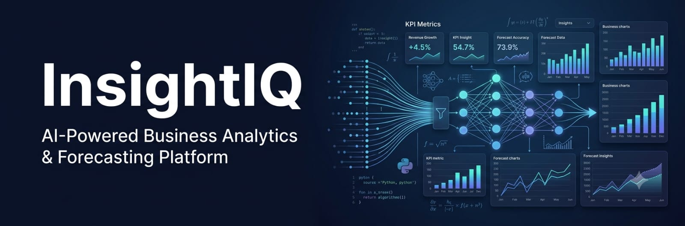
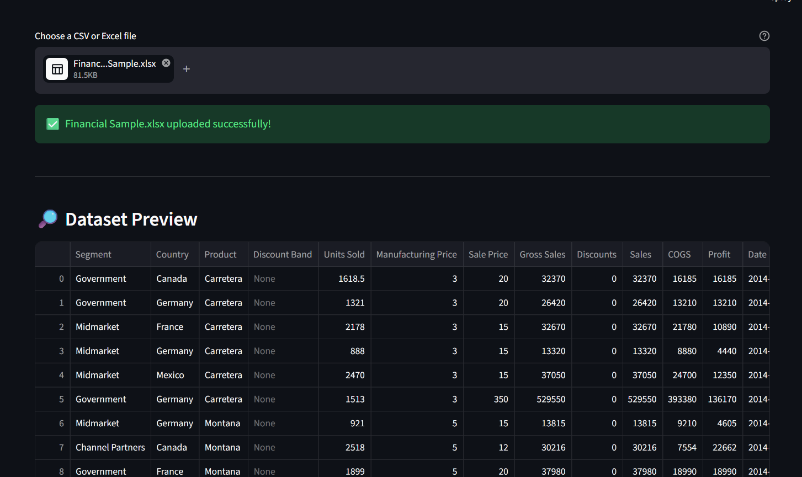
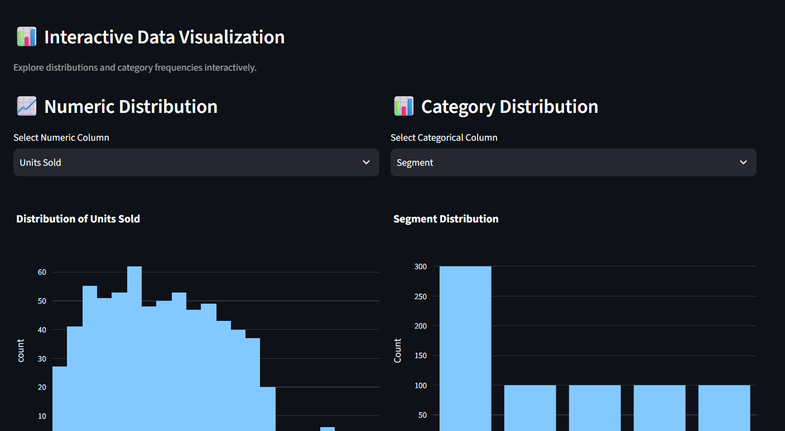
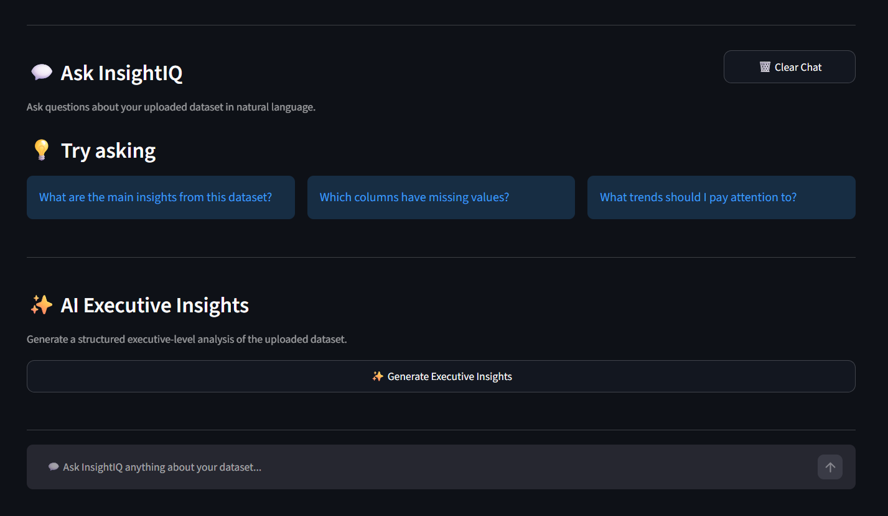
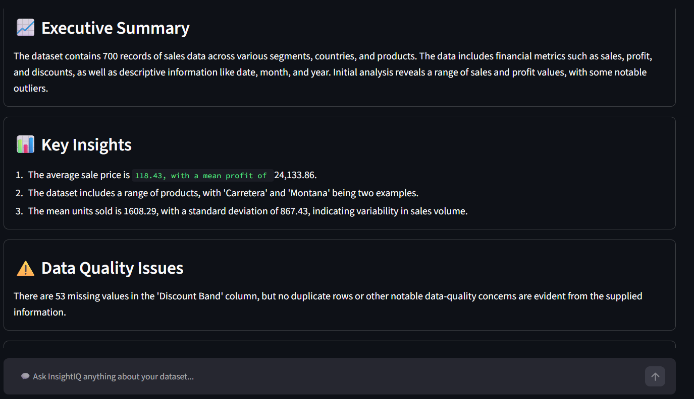
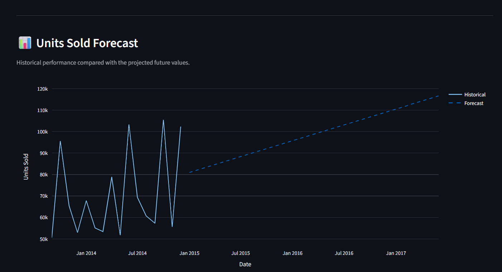
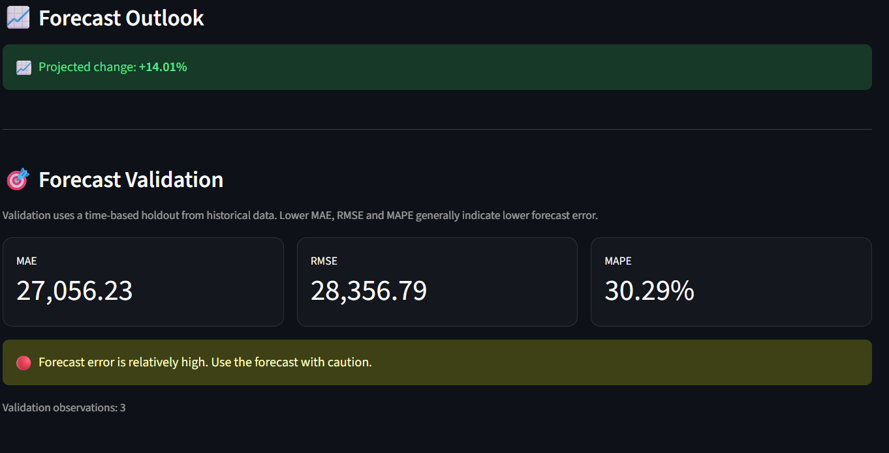
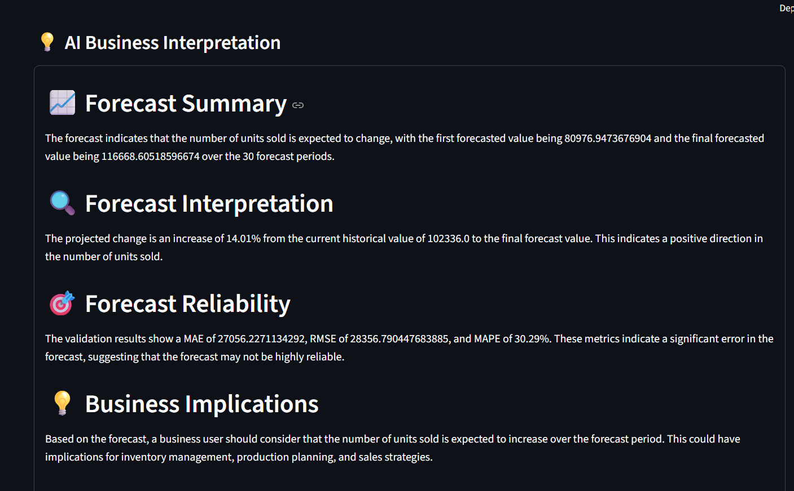
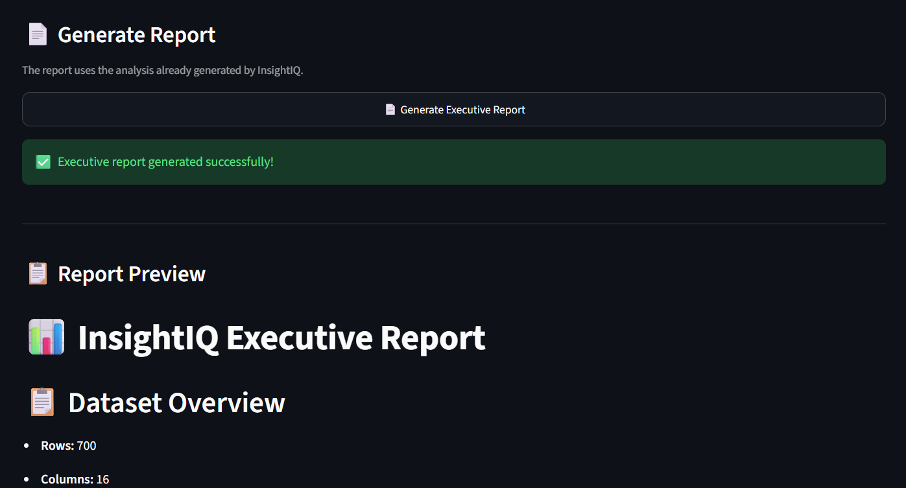
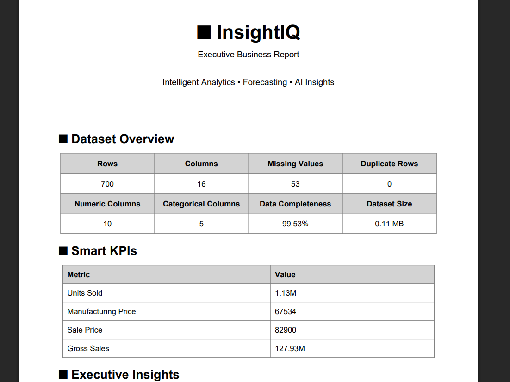

<h1 align="center">

📊 InsightIQ

</h1>

<b>AI-Powered Business Analytics & Forecasting Platform built with Python, Streamlit, Groq and LangChain</b>

AI Analytics • Forecasting • Business Insights • Executive Reporting

🚀 About

InsightIQ is an AI-powered business analytics platform that transforms CSV and Excel datasets into actionable business insights.

The application combines data analysis, interactive visualization, generative AI, time-series forecasting, forecast validation, AI-powered interpretation, and professional executive reporting into one platform.

Upload a dataset, explore the data, ask questions using the AI Analyst, generate business insights, forecast future values, validate the predictions, and download a professional PDF report.

✨ Features

📂 CSV / Excel dataset upload

📊 Interactive business dashboard

📌 Automatic Smart KPI detection

🔎 Dataset preview and data-quality analysis

📈 Interactive Plotly visualizations

🤖 AI-powered Data Analyst

💬 Natural-language dataset questions

✨ AI Executive Insights

📈 Time-series forecasting

🎯 Forecast validation using MAE, RMSE and MAPE

🤖 AI Forecast Explanation

📄 Executive business report

📕 Professional PDF report generation

🔐 API-key security practices

🎨 Consistent Streamlit UI

🛠️ Tech Stack

Python

Streamlit

Pandas

NumPy

Plotly

Statsmodels

Groq

LangChain

Matplotlib

ReportLab

uv

🚀 Installation

Clone Repository

git clone <YOUR_GITHUB_REPOSITORY_URL>

Open Project

cd InsightIQ

Install Dependencies

uv sync

Run

uv run streamlit run Home.py

📸 Screenshots

🏠 Dashboard Overview

InsightIQ's main dashboard provides dataset overview metrics, Smart KPIs, and the initial business-data summary.

📊 Dashboard Visualization

Interactive charts, dataset information, data types, and data-quality metrics help users explore the uploaded dataset.

🤖 AI Analyst

Ask natural-language questions about the dataset and receive AI-powered business analysis without manually writing queries.

✨ AI Executive Insights

InsightIQ converts dataset analysis into structured executive insights including trends, risks, recommendations, and next steps.

📈 Forecasting

Generate future predictions from time-based business data and compare historical performance with forecast values.

🎯 Forecast Validation

Evaluate forecast performance using MAE, RMSE, and MAPE so predictions can be interpreted with an understanding of their accuracy.

🤖 AI Forecast Explanation

The AI converts statistical forecasting results into a business-friendly explanation covering the forecast outlook, reliability, and business implications.

📄 Executive Report

The Executive Report combines important analytical findings, KPIs, AI insights, forecasting information, and recommendations into one report.

📕 Professional PDF Report

Generate and download a professional PDF containing the dataset overview, KPIs, AI insights, forecast chart, validation metrics, and AI forecast explanation.

🔄 Workflow

Upload Dataset
      │
      ▼
Data Exploration
      │
      ▼
Smart KPI Detection
      │
      ▼
Interactive Visualization
      │
      ▼
AI Analyst
      │
      ▼
Executive Insights
      │
      ▼
Time-Series Forecasting
      │
      ▼
Forecast Validation
      │
      ▼
AI Forecast Explanation
      │
      ▼
Executive Report
      │
      ▼
Professional PDF Report

📁 Project Structure

InsightIQ/
├── assets/
│   ├── banner.png
│   └── screenshots/
│       ├── dashboard_overview.png
│       ├── dashboard_visualization.png
│       ├── ai_analyst_chat.png
│       ├── ai_executive_insights.png
│       ├── forecasting_chart.png
│       ├── forecast_validation.png
│       ├── forecast_ai_explanation.png
│       ├── executive_report.png
│       └── pdf_report.png
│
├── pages/
│   ├── Dashboard.py
│   ├── AI_Analyst.py
│   ├── Forecasting.py
│   └── Executive_Report.py
│
├── utils/
│   ├── ui.py
│   ├── llm.py
│   ├── kpis.py
│   ├── insights.py
│   ├── forecasting.py
│   ├── forecast_explanation.py
│   ├── report.py
│   └── pdf_report.py
│
├── Home.py
├── README.md
├── pyproject.toml
└── .gitignore

🔑 API Configuration

InsightIQ uses Groq for AI-powered functionality.

Set your API key using an environment variable or Streamlit secrets.

GROQ_API_KEY=your_api_key_here

⚠️ Never commit your real API key to GitHub.

🎯 Complete Analysis Workflow

Dataset
   ↓
Dashboard
   ↓
KPIs + Visualization
   ↓
AI Analysis
   ↓
Business Insights
   ↓
Forecast
   ↓
Validation
   ↓
AI Interpretation
   ↓
Executive Report
   ↓
PDF

💡 Why InsightIQ?

Traditional business analysis can require separate tools for:

Data cleaning

Visualization

AI analysis

Forecasting

Model validation

Reporting

InsightIQ brings these capabilities together into a single workflow.

Raw Business Data
        ↓
     InsightIQ
        ↓
Analysis + AI + Forecast + Report

🚀 Future Improvements

Anomaly detection

Confidence intervals

Additional forecasting models

Automated dataset profiling

Advanced KPI detection

Database connectivity

Scheduled reports

Cloud deployment

Additional export formats

👨‍💻 Author

Aman Jakhar

Data Science • Machine Learning • AI

⭐ Support

If you like this project, consider giving it a ⭐ on GitHub.

InsightIQ — Turn data into decisions.